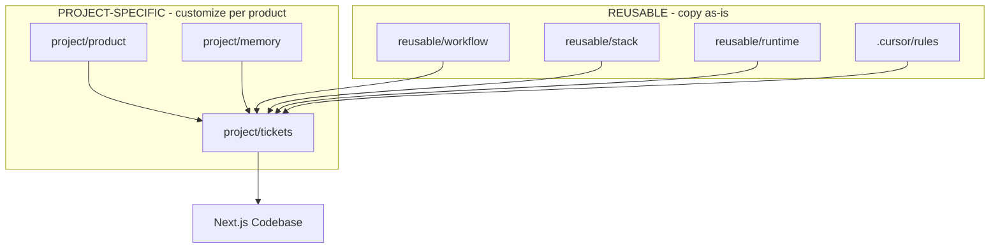

> **Type: REUSABLE** | Copy as-is across Next.js projects. Edit only to improve the shared template.

# File Type Legend

At-a-glance reference for which files are **reusable** vs **project-specific**.

---

## Quick Reference

| Path | Type | What to do |
|------|------|------------|
| `ai/project/product/` | **PROJECT-SPECIFIC** | Fill in for your product |
| `ai/project/memory/` | **PROJECT-SPECIFIC** | Maintain as the project evolves |
| `ai/project/tickets/` | **PROJECT-SPECIFIC** | Store ticket files here |
| `ai/reusable/stack/` | **REUSABLE** | Copy unchanged to new projects |
| `ai/reusable/workflow/` | **REUSABLE** | Copy unchanged to new projects |
| `ai/reusable/runtime/` | **REUSABLE** | Copy unchanged to new projects |
| `.cursor/rules/` | **REUSABLE** | Copy unchanged to new projects |
| `ai/README.md` | **REUSABLE** | Copy unchanged (this guide) |
| `ai/LEGEND.md` | **REUSABLE** | Copy unchanged (this file) |

---

## How to Tell at a Glance

Three signals — no README in every subfolder:

1. **Folder names** — `project/` vs `reusable/`
2. **Line-1 banner** on every doc file
3. **Parent README** when opening `project/` or `reusable/`

### In the file tree

```
ai/
├── LEGEND.md          ← you are here
├── README.md          ← REUSABLE
├── project/           ← PROJECT-SPECIFIC (everything inside)
└── reusable/          ← REUSABLE (everything inside)
```

### When opening a file

Every file starts with a type banner:

```markdown
> **Type: PROJECT-SPECIFIC** | Customize for your product...
```

```markdown
> **Type: REUSABLE** | Copy as-is across Next.js projects...
```

### In parent folder READMEs

`ai/project/README.md` and `ai/reusable/README.md` each have a `# PROJECT-SPECIFIC` or `# REUSABLE` heading when you open those top-level branches.

---

## Structure Diagram



---

## Starting a New Project

1. Copy the entire `ai/` folder and `.cursor/rules/` into your Next.js project.
2. **Leave `ai/reusable/` unchanged.**
3. **Fill in everything under `ai/project/`.**
4. Create tickets in `ai/project/tickets/`.
5. Start building.

---

## When to Edit Each Type

| Type | Edit when... | Do not edit for... |
|------|--------------|-------------------|
| **PROJECT-SPECIFIC** | Product changes, new decisions, bugs found | Improving the shared template |
| **REUSABLE** | Improving the template for all future projects | Product-specific details |
