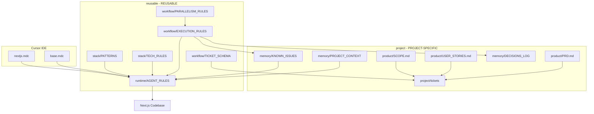

> **Type: REUSABLE** | Copy as-is across Next.js projects. Edit only to improve the shared template.

# AI Development Operating System

A reusable template for ticket-driven, AI-assisted development on Next.js App Router projects.

---

## File Types at a Glance

| Type | Folder | Action |
|------|--------|--------|
| **PROJECT-SPECIFIC** | `ai/project/` | Fill in for your product |
| **REUSABLE** | `ai/reusable/` + `.cursor/rules/` | Copy unchanged to new projects |

See [LEGEND.md](LEGEND.md) for the complete reference. Every file has a type banner on line 1.

---

## What This Is

This `ai/` directory is an **operating system for AI-assisted development**. It defines:

- **What to build** — product docs and scope boundaries (`project/`)
- **How to build it** — stack standards, architecture, and patterns (`reusable/stack/`)
- **How to work** — ticket workflow, parallelism rules, and execution discipline (`reusable/workflow/`)
- **How agents behave** — runtime rules, context policy, and failure recovery (`reusable/runtime/`)
- **What the project knows** — living memory of context, decisions, and issues (`project/memory/`)

---

## Quick Start

### 1. Copy into your project

```bash
cp -r ai/ /path/to/your-nextjs-project/ai/
cp -r .cursor/rules/ /path/to/your-nextjs-project/.cursor/rules/
```

### 2. Fill in project-specific files

Replace `<!-- FILL -->` markers in these files:

| File | What to fill in |
|------|-----------------|
| `ai/project/product/PRD.md` | Product goals, users, metrics |
| `ai/project/product/USER_STORIES.md` | User stories with acceptance criteria |
| `ai/project/product/SCOPE.md` | Phase boundaries and in/out of scope |
| `ai/project/memory/PROJECT_CONTEXT.md` | Repo structure, env vars, integrations |
| `ai/project/memory/DECISIONS_LOG.md` | Architectural decisions as you make them |
| `ai/project/memory/KNOWN_ISSUES.md` | Bugs and tech debt as you discover them |

### 3. Keep reusable files as-is

Everything under `ai/reusable/` and `.cursor/rules/` is shared across projects. Only modify to improve the template.

### 4. Create your first ticket

Store tickets in `ai/project/tickets/`. Follow `ai/reusable/workflow/TICKET_SCHEMA.md`, then execute per `ai/reusable/workflow/EXECUTION_RULES.md`.

---

## Folder Map

```
ai/
├── LEGEND.md              REUSABLE — type reference (start here if unsure)
├── README.md              REUSABLE — this file
│
├── project/               PROJECT-SPECIFIC
│   ├── product/
│   │   ├── PRD.md           Product requirements
│   │   ├── USER_STORIES.md  User stories and acceptance criteria
│   │   └── SCOPE.md         Phase boundaries
│   ├── memory/
│   │   ├── PROJECT_CONTEXT.md  Repo map and operational context
│   │   ├── DECISIONS_LOG.md    Architecture decision records
│   │   └── KNOWN_ISSUES.md     Bugs, debt, and workarounds
│   └── tickets/           One Markdown file per ticket
│
└── reusable/              REUSABLE
    ├── stack/
    │   ├── NEXTJS_STACK.md    Technology choices and conventions
    │   ├── ARCHITECTURE.md    Feature-based architecture rules
    │   ├── TECH_RULES.md      Hard technical constraints
    │   ├── PATTERNS.md        Copy-paste implementation patterns
    │   └── DEPENDENCIES.md    Approved packages and addition process
    ├── workflow/
    │   ├── WORKFLOW.md            End-to-end development lifecycle
    │   ├── TICKET_SCHEMA.md       Required ticket fields and example
    │   ├── PARALLELISM_RULES.md   When tickets can run in parallel
    │   ├── EXECUTION_RULES.md     Rules for implementers
    │   └── MERGE_RULES.md         Branch, PR, and merge procedures
    └── runtime/
        ├── SYSTEM_PROMPT.md            Copy-paste agent system prompt (standing identity)
        ├── TICKET_EXECUTION_PROMPT.md  Copy-paste per-ticket chat prompt (anti-drift)
        ├── AGENT_RULES.md              Do/don't lists and protocols
        ├── CONTEXT_POLICY.md           What to load and when
        └── FAILURE_MODES.md            Failure catalog and recovery
```

---

## How It Fits Together



---

## Onboarding Checklist

- [ ] Copy `ai/` and `.cursor/rules/` into the project
- [ ] Fill in `ai/project/product/PRD.md`
- [ ] Fill in `ai/project/product/USER_STORIES.md`
- [ ] Fill in `ai/project/product/SCOPE.md`
- [ ] Fill in `ai/project/memory/PROJECT_CONTEXT.md`
- [ ] Initialize `ai/project/memory/DECISIONS_LOG.md`
- [ ] Initialize `ai/project/memory/KNOWN_ISSUES.md`
- [ ] Create first ticket in `ai/project/tickets/`
- [ ] Verify `.cursor/rules/base.mdc` is active (`alwaysApply: true`)
- [ ] Execute first ticket per `ai/reusable/workflow/EXECUTION_RULES.md`

---

## Key Principles

1. **Every implementation starts from a ticket.** No ad-hoc coding.
2. **Tickets define scope.** AI must not modify files outside ticket scope.
3. **Production-ready code only.** No mocks unless the ticket allows it.
4. **Parallel when safe.** No shared files, schema, contracts, or dependencies.
5. **Know your file types.** `project/` = customize; `reusable/` = copy as-is.

---

## Cursor Rules

| File | Scope | Type |
|------|-------|------|
| `.cursor/rules/base.mdc` | Always applies | REUSABLE |
| `.cursor/rules/nextjs.mdc` | `**/*.{ts,tsx}` | REUSABLE |

---

## For AI Agents

Start with `ai/reusable/runtime/TICKET_EXECUTION_PROMPT.md` — paste into Agent chat with `@` your ticket file. For standing identity, see `SYSTEM_PROMPT.md`. Do not proceed without a ticket.

---

## Customizing the Template

| Change type | Edit |
|-------------|------|
| Product requirements, scope, context | `ai/project/` only |
| Stack standards, patterns | `ai/reusable/stack/` |
| Workflow, tickets, merge process | `ai/reusable/workflow/` |
| Agent behavior | `ai/reusable/runtime/` and `.cursor/rules/` |

Never put product-specific details in `ai/reusable/`.
