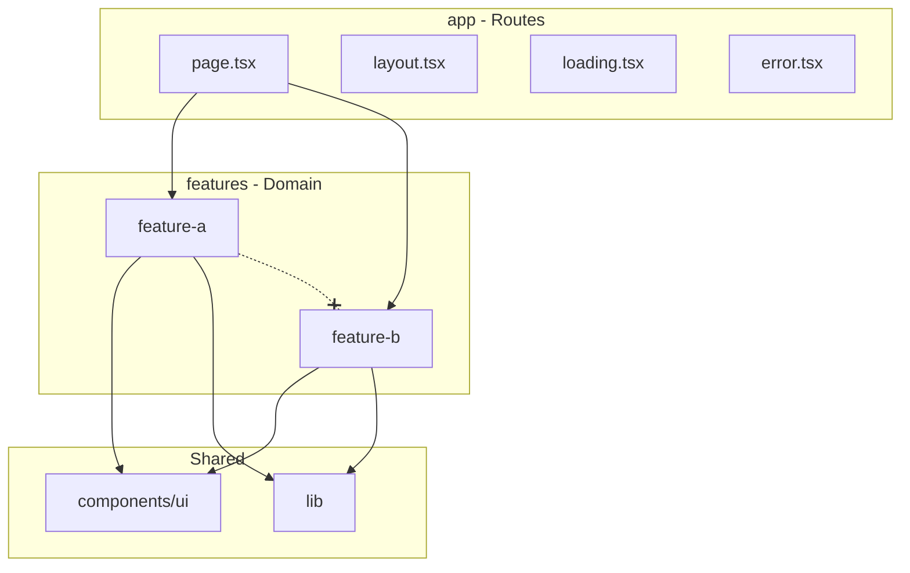

> **Type: REUSABLE** | Copy as-is across Next.js projects. Edit only to improve the shared template.

# Architecture

Feature-based architecture for Next.js App Router projects. This document defines layer responsibilities, dependency rules, and module boundaries.

---

## Overview



**Dependency direction:** `app/` → `features/` → `lib/` + `components/ui/`

Features must not import from sibling features. Cross-feature communication goes through `app/` composition or shared `lib/`.

---

## Layer Responsibilities

### `src/app/` — Routes and Composition

**Owns:** URL structure, layouts, metadata, route-level loading/error states.

**Does not own:** Business logic, database queries, validation schemas.

```tsx
// src/app/(dashboard)/tasks/page.tsx
import { getTasks } from "@/features/tasks/lib/queries";
import { TaskBoard } from "@/features/tasks/components/task-board";
import { requireAuth } from "@/features/auth/lib/require-auth";

export const metadata = { title: "Tasks" };

export default async function TasksPage() {
  const session = await requireAuth();
  const tasks = await getTasks(session.user.id);
  return <TaskBoard tasks={tasks} />;
}
```

Route files should be under 30 lines. If longer, extract to feature components.

### `src/features/<name>/` — Domain Modules

**Owns:** Business logic, Server Actions, domain types, feature-specific components.

Each feature is a self-contained module with a public API via `index.ts`.

```
src/features/tasks/
├── actions/
│   ├── create-task.ts
│   ├── update-task.ts
│   └── delete-task.ts
├── components/
│   ├── task-board.tsx
│   ├── task-card.tsx
│   └── task-form.tsx
├── schemas/
│   └── task.schema.ts
├── types/
│   └── task.types.ts
├── lib/
│   ├── queries.ts
│   └── mutations.ts
└── index.ts
```

**`index.ts` exports only the public API:**

```typescript
// features/tasks/index.ts
export { TaskBoard } from "./components/task-board";
export { createTask, updateTask } from "./actions";
export type { Task, TaskStatus } from "./types/task.types";
```

Internal files (`lib/queries.ts`, `schemas/`) are not exported from the barrel.

### `src/components/ui/` — Shared UI Primitives

**Owns:** Reusable, domain-agnostic UI components (buttons, inputs, dialogs).

Typically shadcn/ui components. No business logic. No feature imports.

### `src/lib/` — Shared Infrastructure

**Owns:** Database client, env validation, logging, shared utilities.

**Does not own:** Domain logic. If logic is feature-specific, it belongs in the feature.

---

## Dependency Rules

| From | Can Import | Cannot Import |
|------|------------|---------------|
| `app/` | `features/`, `components/ui/`, `lib/` | — |
| `features/<a>/` | `components/ui/`, `lib/` | `features/<b>/` (sibling) |
| `components/ui/` | `lib/utils` only | `features/`, `app/` |
| `lib/` | External packages only | `features/`, `app/`, `components/` |

### Cross-Feature Communication

When feature A needs something from feature B:

1. **Compose in `app/`** — the route page imports from both features and wires them together.
2. **Extract to `lib/`** — if the shared logic is truly generic (e.g., pagination helper).
3. **Never import across features** — this creates coupling that blocks parallel development.

```tsx
// Good: compose in app layer
// app/(dashboard)/page.tsx
import { UserGreeting } from "@/features/auth";
import { TaskSummary } from "@/features/tasks";

export default async function DashboardPage() {
  return (
  <>
    <UserGreeting />
    <TaskSummary />
  </>
  );
}

// Bad: tasks feature importing from auth feature
// features/tasks/components/task-board.tsx
import { useSession } from "@/features/auth/hooks/use-session"; // VIOLATION
```

---

## Server Action Placement

Server Actions live in `features/<name>/actions/`, one file per action or grouped by entity.

```
features/tasks/actions/
├── create-task.ts
├── update-task.ts
└── delete-task.ts
```

Each action file:

1. Has `"use server"` at the top
2. Imports its Zod schema from `../schemas/`
3. Imports business logic from `../lib/`
4. Returns a typed `ActionResult`

---

## Schema Placement

Zod schemas live in `features/<name>/schemas/`.

```typescript
// features/tasks/schemas/task.schema.ts
import { z } from "zod";

export const taskStatusSchema = z.enum(["todo", "in_progress", "done"]);

export const createTaskSchema = z.object({
  title: z.string().min(1).max(200),
  description: z.string().max(2000).optional(),
  assigneeId: z.string().uuid(),
  dueDate: z.coerce.date().optional(),
});

export type CreateTaskInput = z.infer<typeof createTaskSchema>;
```

Schemas are the single source of truth. Types are derived with `z.infer`, not duplicated.

---

## Type Placement

- **Feature types:** `features/<name>/types/`
- **Inferred from Zod:** prefer `z.infer<typeof schema>` over manual interfaces
- **Shared types used by 2+ features:** `lib/types/` (rare; avoid premature sharing)

```typescript
// features/tasks/types/task.types.ts
import type { z } from "zod";
import type { taskStatusSchema } from "../schemas/task.schema";

export type TaskStatus = z.infer<typeof taskStatusSchema>;

export type Task = {
  id: string;
  title: string;
  status: TaskStatus;
  assigneeId: string;
  createdAt: Date;
  updatedAt: Date;
};
```

---

## API Route Handlers

Use `app/api/` only for:

- Webhooks from external services
- Third-party callbacks (OAuth, payment providers)
- Endpoints consumed by non-Next.js clients

All user-facing mutations use Server Actions.

---

## File Naming Conventions

| Type | Convention | Example |
|------|------------|---------|
| Components | kebab-case.tsx | `task-card.tsx` |
| Server Actions | kebab-case.ts | `create-task.ts` |
| Schemas | kebab-case.schema.ts | `task.schema.ts` |
| Types | kebab-case.types.ts | `task.types.ts` |
| Utilities | kebab-case.ts | `format-date.ts` |
| Tests | *.test.ts / *.test.tsx | `create-task.test.ts` |

---

## Adding a New Feature

1. Create `src/features/<name>/` with the standard subdirectories.
2. Add `index.ts` with public exports only.
3. Create route(s) in `app/` that compose the feature.
4. Add schemas before actions.
5. Log significant architectural choices in `ai/project/memory/DECISIONS_LOG.md`.
