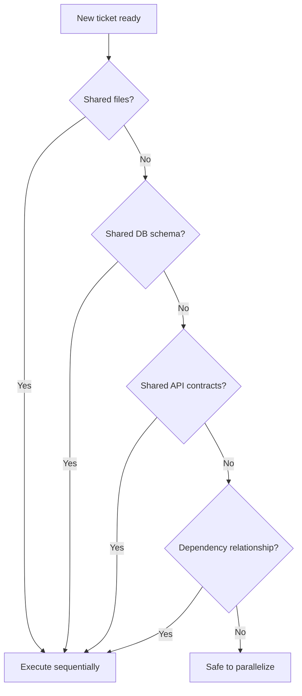

> **Type: REUSABLE** | Copy as-is across Next.js projects. Edit only to improve the shared template.

# Parallelism Rules

Rules for running multiple tickets or AI agents concurrently without conflicts.

---

## Core Rule

**Tickets may run in parallel only when ALL of the following are true:**

1. No shared files
2. No shared database schema or migrations
3. No shared API contracts (types, routes, OpenAPI specs)
4. No dependency relationship (`blocks` / `blocked_by`)

If any condition fails, tickets must execute **sequentially** in dependency order.

---

## Decision Flow



---

## Conflict Detection Checklist

Run this before starting a ticket alongside others already in progress.

### 1. File Overlap

Compare `files.create`, `files.modify`, and `files.delete` across all in-progress tickets.

```
Ticket A modifies: src/features/tasks/actions/create-task.ts
Ticket B modifies: src/features/tasks/actions/create-task.ts
→ CONFLICT: sequential execution required
```

Also check for indirect overlap:

- Ticket A creates `src/features/tasks/index.ts`
- Ticket B modifies `src/features/tasks/index.ts`
→ CONFLICT even though A "creates" and B "modifies"

### 2. Database Schema Overlap

Compare migration files and schema definitions.

```
Ticket A: adds "tasks" table migration
Ticket B: adds "tasks" table index migration
→ CONFLICT: same table
```

```
Ticket A: adds "tasks" table
Ticket B: adds "notifications" table
→ SAFE: different tables
```

### 3. API Contract Overlap

Shared contracts include:

- TypeScript types exported from `index.ts` barrel files
- Zod schemas used by multiple features
- API Route Handler paths
- Server Action signatures consumed by other features

```
Ticket A: defines TaskStatus type in features/tasks
Ticket B: imports TaskStatus from features/tasks
→ CONFLICT: B depends on A's contract
```

### 4. Dependency Relationship

Check `blocks`, `blocked_by`, and `related` fields.

```
Ticket A blocked_by: TICKET-003
Ticket B id: TICKET-003, status: in_progress
→ Ticket A must wait
```

---

## Parallel Execution Groups

When multiple tickets are safe to parallelize, group them:

```yaml
# Parallel Group 1 (safe)
- TICKET-005: Add notification bell component
- TICKET-006: Add user profile page
# No shared files, schemas, or dependencies

# Sequential Chain
- TICKET-003: Create tasks DB schema (must complete first)
- TICKET-004: Add task queries (blocked_by TICKET-003)
- TICKET-007: Add task mutations (blocked_by TICKET-004)
```

---

## Merge Order

When parallel tickets complete, merge in this order:

1. **Infrastructure and schema tickets first** (migrations, shared lib)
2. **Feature tickets in dependency order** (blocked_by chain)
3. **Independent parallel tickets** in any order (no conflicts)

If a merge conflict occurs despite passing the parallelism check:

1. Stop merging
2. Identify the missed overlap
3. Update PARALLELISM_RULES if a new conflict category is discovered
4. Resolve sequentially

---

## AI Agent Parallel Execution

When running multiple AI agents:

| Rule | Detail |
|------|--------|
| One agent per ticket | Never assign one agent multiple tickets |
| Independent branches | Each agent works on `ticket/TICKET-NNN-slug` |
| No cross-agent communication | Agents do not share state; the ticket is the contract |
| Human reviews all PRs | Parallel agents do not merge their own work |
| Re-check before starting | Run the checklist even if tickets were planned as parallel |

---

## Known Issue Interactions

Before parallel execution, check `ai/project/memory/KNOWN_ISSUES.md`:

- If two tickets touch the same affected area as an open issue, they likely conflict.
- If a ticket's workaround says "do not modify X until TICKET-NNN", that ticket blocks parallelism on X.

---

## Examples

### Safe Parallel

```
TICKET-010: Add settings page (files: src/app/(dashboard)/settings/)
TICKET-011: Add notification schema (files: src/features/notifications/schemas/)
→ No overlap. Safe to parallelize.
```

### Unsafe Parallel

```
TICKET-012: Refactor auth session helper (files: src/features/auth/lib/require-auth.ts)
TICKET-013: Add delete task action (files: src/features/tasks/actions/delete-task.ts)
→ No direct file overlap, BUT TICKET-013 imports require-auth.ts
→ CONFLICT on shared API contract. Sequential.
```

### Unsafe Parallel (Schema)

```
TICKET-014: Add dueDate column to tasks table
TICKET-015: Add task filtering by status
→ Both touch tasks table schema. Sequential.
```

---

## When in Doubt

**Default to sequential.** The cost of waiting is lower than the cost of merge conflicts and rework.
