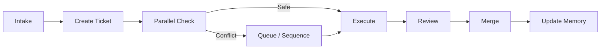

> **Type: REUSABLE** | Copy as-is across Next.js projects. Edit only to improve the shared template.

# Development Workflow

Ticket-driven development workflow for AI-assisted and human development. Every change to the codebase follows this lifecycle.

---

## Principles

1. **Every implementation starts from a ticket.** No ad-hoc coding.
2. **Tickets define scope.** If it's not in the ticket, don't build it.
3. **AI must not modify files outside ticket scope.**
4. **AI must ask for clarification when requirements are missing.**
5. **Production-ready code only.** No mocks, stubs, or TODO placeholders unless the ticket explicitly allows them.

---

## Lifecycle



### 1. Intake

Work enters from:

- User stories (`ai/project/product/USER_STORIES.md`)
- Bug reports
- Technical debt items (`ai/project/memory/KNOWN_ISSUES.md`)
- Stakeholder requests

Verify the work is **in scope** per `ai/project/product/SCOPE.md` before creating a ticket.

### 2. Create Ticket

Create a ticket using the schema in [TICKET_SCHEMA.md](./TICKET_SCHEMA.md).

A ticket is **not ready** until it has:

- [ ] Clear scope (in-scope and out-of-scope)
- [ ] Listed files (create, modify, delete)
- [ ] Dependencies (blocks, blocked_by)
- [ ] Acceptance criteria
- [ ] Definition of done

Set status to `ready` only when all fields are complete.

### 3. Parallel Check

Before starting work, run the checklist in [PARALLELISM_RULES.md](./PARALLELISM_RULES.md).

- If safe: proceed (or assign to parallel agent)
- If conflict: queue behind blocking ticket(s)

### 4. Execute

Follow [EXECUTION_RULES.md](./EXECUTION_RULES.md).

The executor (human or AI):

1. Reads the ticket
2. Reads project context and known issues
3. Implements within scope
4. Runs lint, typecheck, tests
5. Sets ticket status to `review`

### 5. Review

Reviewer checks:

- [ ] All acceptance criteria met
- [ ] Only ticket-scoped files changed
- [ ] Follows stack standards (TECH_RULES, PATTERNS)
- [ ] No new known issues introduced
- [ ] Tests pass

### 6. Merge

Follow [MERGE_RULES.md](./MERGE_RULES.md).

### 7. Update Memory

After merge:

- Log architectural decisions in `ai/project/memory/DECISIONS_LOG.md`
- Update or resolve issues in `ai/project/memory/KNOWN_ISSUES.md`
- Update `ai/project/memory/PROJECT_CONTEXT.md` if structure changed
- Set ticket status to `done`

---

## Ticket Status Flow

```
draft → ready → in_progress → review → done
                  ↓
               blocked (returns to in_progress when unblocked)
```

| Status | Meaning |
|--------|---------|
| `draft` | Ticket created but incomplete |
| `ready` | All fields filled, ready for execution |
| `in_progress` | Actively being worked on |
| `blocked` | Waiting on a dependency |
| `review` | Implementation complete, awaiting review |
| `done` | Merged and verified |

---

## Roles

| Role | Responsibility |
|------|----------------|
| **Ticket author** | Defines scope, AC, and files |
| **Executor** | Implements within scope (human or AI agent) |
| **Reviewer** | Verifies AC, scope compliance, and standards |
| **Merger** | Handles branch merge and conflict resolution |

In solo or AI-assisted workflows, one person/agent may hold multiple roles but must still perform each step.

---

## Reference Documents

| Document | When to Read |
|----------|--------------|
| [TICKET_SCHEMA.md](./TICKET_SCHEMA.md) | Creating or reading tickets |
| [PARALLELISM_RULES.md](./PARALLELISM_RULES.md) | Before starting any ticket |
| [EXECUTION_RULES.md](./EXECUTION_RULES.md) | During implementation |
| [MERGE_RULES.md](./MERGE_RULES.md) | Before and during merge |
| [../stack/TECH_RULES.md](../stack/TECH_RULES.md) | During implementation |
| [../stack/PATTERNS.md](../stack/PATTERNS.md) | During implementation |
| [../../project/memory/PROJECT_CONTEXT.md](../../project/memory/PROJECT_CONTEXT.md) | Before starting any ticket |
| [../../project/memory/KNOWN_ISSUES.md](../../project/memory/KNOWN_ISSUES.md) | Before starting any ticket |

---

## Quick Decision Guide

| Situation | Action |
|-----------|--------|
| No ticket exists | Create one. Do not code. |
| Ticket is `draft` | Complete it before starting. |
| Requirement is ambiguous | Ask for clarification. Do not guess. |
| Change requires files not in ticket | Stop. Update ticket scope first. |
| Bug found outside ticket scope | Log in KNOWN_ISSUES.md. Do not fix unless ticket scope includes it. |
| Architectural choice needed | Log in DECISIONS_LOG.md. Proceed if within scope. |
| Two tickets might conflict | Check PARALLELISM_RULES. Sequence if needed. |
