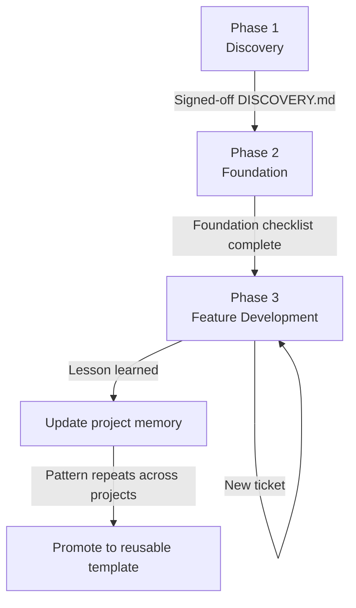

> **Type: REUSABLE** | Copy as-is across projects. Edit only to improve the shared template.

# Development Workflow

Three-phase, skill-powered workflow for AI-assisted development. Every project follows this lifecycle — in order, with gates between phases.

---

## Principles

1. **Phases are sequential.** Phase 2 cannot start until Phase 1 is signed off. Phase 3 cannot start until Phase 2 is complete.
2. **Every feature implementation starts from a ticket.** No ad-hoc coding in Phase 3.
3. **Tickets define scope.** If it's not in the ticket, don't build it.
4. **AI must not modify files outside ticket scope.**
5. **Foundation before features.** Only set up what the project actually needs — no boilerplate bloat.
6. **The template evolves.** Project-specific lessons go into `ai/project/memory/`. Patterns that repeat across projects get promoted back into `ai/reusable/`.

---

## The Three Phases


```mermaid
flowchart TD
  P1[Phase 1\nDiscovery] -->|Signed-off DISCOVERY.md| P2[Phase 2\nFoundation]
  P2 -->|Foundation checklist complete| P3[Phase 3\nFeature Development]
  P3 -->|Lesson learned| Mem[Update project memory]
  Mem -->|Pattern repeats across projects| Template[Promote to reusable template]
  P3 -->|New ticket| P3
```

---

## Phase 1 — Discovery

**Goal:** Clarify exactly what to build, for whom, and why — before a single line of code or a single dependency is chosen.

**Gate to enter Phase 2:** `ai/project/product/DISCOVERY.md` is complete and explicitly signed off.

### Skills to invoke

| Skill | When |
|-------|------|
| `interview-me` | Start here. Extract intent before anything else. |
| `idea-refine` | Stress-test and expand the concept once intent is clear. |
| `spec-driven-development` | Write the confirmed scope as a structured spec. |
| `planning-and-task-breakdown` | Break the spec into ordered foundation + feature work. |
| `doubt-driven-development` | Adversarial review of the plan before signing off. |

### Outputs

- `ai/project/product/DISCOVERY.md` — confirmed intent, stack rationale, explicit out-of-scope
- `ai/project/product/PRD.md` — product requirements (filled from DISCOVERY)
- `ai/project/product/USER_STORIES.md` — user stories with acceptance criteria
- `ai/project/product/SCOPE.md` — phase boundaries

### Rules

- Do not choose a stack until Phase 1 is complete.
- Do not create tickets until Phase 1 is signed off.
- If requirements are ambiguous, use `interview-me` — do not guess.

---

## Phase 2 — Foundation

**Goal:** Set up only the infrastructure the project actually needs, based on Phase 1 output. No boilerplate. No speculative setup.

**Gate to enter Phase 3:** Every `required` item in `ai/project/FOUNDATION_CHECKLIST.md` is marked `done`.

### Skills to invoke

| Skill | When |
|-------|------|
| `source-driven-development` | Pick libraries from official docs, not guesses or habits. |
| `api-and-interface-design` | Define data contracts and API boundaries before writing code. |
| `security-and-hardening` | Bake auth, input validation, and secrets handling in from the start. |
| `planning-and-task-breakdown` | Turn foundation items into tickets if they need scoped implementation. |

### Conditional foundation areas

Only set up what the project actually requires. For each area, mark it `required`, `not needed`, or `done` in `ai/project/FOUNDATION_CHECKLIST.md`.

| Area | Examples |
|------|---------|
| Auth | OAuth provider, session management, protected routes |
| Database | Schema, migrations, ORM setup, connection pooling |
| Environment | Env variable validation at startup |
| Error handling | Global error strategy, user-facing error format |
| UI primitives | Component library, design tokens, base layout |
| File storage | Object store, signed URLs, upload handling |
| Background jobs | Queue architecture for long-running tasks |

### Rules

- Do not start feature tickets until the checklist gate is met.
- Foundation tickets use the same `TICKET_SCHEMA.md` as feature tickets.
- Log every tech choice in `ai/project/memory/DECISIONS_LOG.md`.
- If a foundation area is `not needed`, record why in DECISIONS_LOG.

---

## Phase 3 — Feature Development

**Goal:** Build features incrementally using ticket-driven development. Treat the codebase and memory files as living documents.

### Skills to invoke

| Skill | When |
|-------|------|
| `incremental-implementation` | Always. Deliver in small, verifiable steps. |
| `test-driven-development` | Always. Tests before or alongside implementation. |
| `frontend-ui-engineering` | When building any user-facing UI. |
| `api-and-interface-design` | When defining new endpoints or data contracts. |
| `code-review-and-quality` | Before every merge. |
| `code-simplification` | When complexity accumulates across tickets. |
| `security-and-hardening` | When ticket involves auth, input, or data exposure. |
| `performance-optimization` | When there is evidence of a bottleneck — not speculatively. |
| `debugging-and-error-recovery` | When a ticket uncovers a bug or unexpected behavior. |
| `documentation-and-adrs` | When an architectural decision is made. |
| `git-workflow-and-versioning` | Every commit, branch, and release. |

### Feature ticket lifecycle

```
draft → ready → in_progress → review → done
                    ↓
                 blocked (returns to in_progress when unblocked)
```

| Status | Meaning |
|--------|---------|
| `draft` | Ticket created but incomplete |
| `ready` | All fields filled, ready for execution |
| `in_progress` | Actively being worked on |
| `blocked` | Waiting on a dependency |
| `review` | Implementation complete, awaiting review |
| `done` | Merged and verified |

### Feature folder structure

```
ai/project/features/
└── <feature_name>/
    └── tickets/
        ├── TICKET-001-short-slug.md
        └── TICKET-002-short-slug.md
```

### After each merge — Update memory

- Log architectural decisions → `ai/project/memory/DECISIONS_LOG.md`
- Update or resolve issues → `ai/project/memory/KNOWN_ISSUES.md`
- Update repo map if structure changed → `ai/project/memory/PROJECT_CONTEXT.md`
- Set ticket status to `done`

### Promote lessons to template

If a pattern, rule, or checklist item proves useful across features:
- Project-specific friction → update `ai/project/memory/` files
- Repeating cross-project pattern → update `ai/reusable/` files

This is how the template improves over time.

---

## Cross-Phase Skills

Use these at any phase when the situation calls for it:

| Skill | When to use |
|-------|-------------|
| `context-engineering` | Start of any session — set up agent context correctly |
| `observability-and-instrumentation` | Before shipping anything to production |
| `ci-cd-and-automation` | When setting up or modifying build/deploy pipelines |
| `shipping-and-launch` | Pre-launch checklist and rollback strategy |
| `browser-testing-with-devtools` | Debug and verify UI in a real browser |
| `extract-design-kit` | Capture visual language from a reference site |
| `graphify` | Build a knowledge graph of the codebase |
| `deprecation-and-migration` | Remove old systems or migrate safely |
| `using-agent-skills` | When unsure which skill applies — invoke this first |

---

## Quick Decision Guide

| Situation | Action |
|-----------|--------|
| No DISCOVERY.md | Run Phase 1. Do not write code. |
| DISCOVERY.md exists but foundation checklist is incomplete | Run Phase 2. No feature tickets yet. |
| Foundation checklist complete | Phase 3 is open. Create feature tickets. |
| No ticket exists for a feature | Create one. Do not code. |
| Ticket is `draft` | Complete it before starting. |
| Requirement is ambiguous | Use `interview-me`. Do not guess. |
| Change requires files not in ticket | Stop. Update ticket scope first. |
| Bug found outside ticket scope | Log in KNOWN_ISSUES.md. Do not fix unless in scope. |
| Architectural choice needed | Log in DECISIONS_LOG.md. Proceed if within scope. |
| Pattern keeps appearing across projects | Promote it to `ai/reusable/`. |

---

## Reference Documents

| Document | When to Read |
|----------|-------------|
| [TICKET_SCHEMA.md](./TICKET_SCHEMA.md) | Creating or reading tickets |
| [PARALLELISM_RULES.md](./PARALLELISM_RULES.md) | Before starting any ticket |
| [EXECUTION_RULES.md](./EXECUTION_RULES.md) | During implementation |
| [MERGE_RULES.md](./MERGE_RULES.md) | Before and during merge |
| [../runtime/SKILLS_MAP.md](../runtime/SKILLS_MAP.md) | Which skill to use at each phase |
| [../stack/TECH_RULES.md](../stack/TECH_RULES.md) | During implementation |
| [../stack/PATTERNS.md](../stack/PATTERNS.md) | During implementation |
| [../../project/product/DISCOVERY.md](../../project/product/DISCOVERY.md) | Phase 1 gate document |
| [../../project/FOUNDATION_CHECKLIST.md](../../project/FOUNDATION_CHECKLIST.md) | Phase 2 gate document |
| [../../project/memory/PROJECT_CONTEXT.md](../../project/memory/PROJECT_CONTEXT.md) | Before starting any ticket |
| [../../project/memory/KNOWN_ISSUES.md](../../project/memory/KNOWN_ISSUES.md) | Before starting any ticket |
